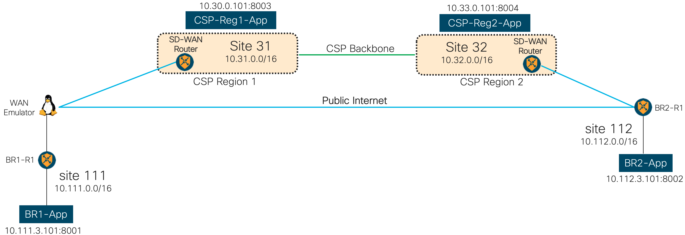
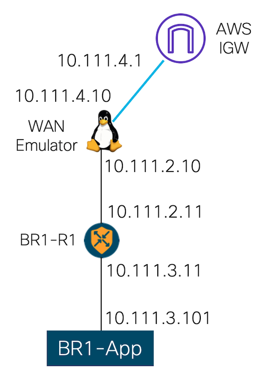

# Cisco SD-WAN Cloud onRamp for Multi-Cloud lab

## TL;DR Summary

This project creates virtual infrastructure with Terraform on public cloud, which will be used for Cisco SD-WAN Cloud onRamp for Multi-cloud lab.

If you are new to Cisco Cloud onRamp, please visit [Cisco Online Documentation](https://www.cisco.com/c/en/us/solutions/enterprise-networks/sd-wan/cloud-onramp.html) 
and do the [Sandbox lab](http://cs.co/CoR-Trial) first. The Sandbox offers a possibility to learn the basics and configuration workflow by following step-by-step
configuration guide. You do not need any cloud accounts or prerequisites, the whole setup will be brought up for you automatically and you have full access for 2 hours free of charge.

If you want to create your own setup and test specific use cases, this project helps you and automates creation of two virtual branches and two cloud-based apps.
You can use this infrastructure to test site-to-site and site-to-cloud uses cases, which Cisco Cloud onRamp offers. The following diagram shows topology, which will be created.


As cloud- and branch-based apps we use a simple web server running on different ports on Linux VM. By creating an SD-WAN policy, you can route traffic via public internet or CSP backbone. 
An example for such traffic steering policy will be given in the SD-WAN part based on TCP ports 8001-8004.

Both virtual branches will be implemented with Cisco CSR 1000v virtual routers. Branch 1 has also a WAN emulator, which can introduce configurable loss, latency and delay on public internet path.
This is implemented using Linux Traffic Control (tc) capabilities.

Amazon Web Services (AWS) is used as Cloud Service Provider (CSP) to host both virtual branches. This can easily be changed to Azure or GCP by changing Terraform Providers and adjusting the code.
CSP choice for branch hosting is not relevant for Cloud onRamp functionality and tests. 

Summary:
- Terraform scripts from this project will create: 
  * two branches with CSR1000v virtual routers and Linux hosts in different AWS regions
  * two cloud-based apps with webserver running on different ports
- Cisco Cloud onRamp automation used after initial Terraform deployment will create:
  * two Catalyst 8000v routers acting as cloud gateways
  * one AWS TGW per region
  * SD-WAN tunnel over AWS Backbone
  
Because we run BFD (Bidirectional Forwarding Detection) packets by default every second over every SD-WAN tunnel, you will have full visibility into AWS backbone in terms of loss, latency and delay.

***

**Table of Content**
- [TL;DR Summary](#tl-dr-summary)
- [Getting Started](#getting-started)
  * [Prerequisites](#prerequisites)
  * [Software versions used during creation of this lab](#software-versions-used-during-creation-of-this-lab)
  * [Creating virtual branch infrastructure](#creating-virtual-branch-infrastructure)
  * [Configuring WAN Emulator](#configuring-wan-emulator)
  * [Post-deployment fine tuning](#post-deployment-fine-tuning)
  * [Creating Branch2](#creating-branch2)
  * [Creating cloud-based Apps](#creating-cloud-based-apps)
- [SD-WAN Cloud onRamp Configuration](#sd-wan-cloud-onramp-configuration)


***

## Getting Started

### Prerequisites

Before you begin, please make sure, that the following mandatory criteria are met:
- [x] a computer with installed Terraform environment including CSP provider and configuration.
- [x] you have an account and can use at least one of the following CSP: AWS, Azure or GCP
- [x] you have an existing SD-WAN network with vManage, vBond and vSmart (SD-WAN Controllers) running the following software versions:
  >| CSP   | Controller |
  | :----: | :----:     |
  | AWS   |  20.3      |
  | Azure |  20.4      |  
  | GCP   |  20.5      |  
- [x] 4 SD-WAN licenses for Cisco Catalyst 8000v (c8kv) virtual routers acting as cloud gateways. In each CSP region, Cloud onRamp Automation will spin up two c8kv instances.
- [x] 2 SD-WAN licenses for Cisco CSR1000v virtual routers acting as branch routers.


For example if you want to test Cloud onRamp with Azure vWAN, you will need at least 20.4 software running on all SD-WAN controllers.
You can still have virtual branches hosted on a different CSP, but if you want to test Cloud onRamp automation workflow for Azure, you need at least 20.4 controller software.\
If you do not have SD-WAN setup at all, you will need to create one. Please work with your local Cisco contacts and ask for Proof of Concept (PoC) setup.

Please make sure, that your CSP account has enough ressources to spin up needed infrastructure. In AWS case, please double check the following:
- you can create enough basic elements like VPCs, Subnets, IGWs, TGW, etc.
- you have enough elastic IPs: calculate with two Elastic IPs per VM (one for out-of-band management and one for internet access) to be conservative
- you have ssh key registered in appropriate regions


### Software versions used during creation of this lab

- Terraform v0.14.9, AWS Provider v3.32.0
- SD-WAN Controllers: 20.5.0
- CSR1000v on virtual branches: 17.03.02prd9
- C8kv as cloud gateways: 17.05.01prd5
- Linux for apps and WAN-Emulator: Amazon Linux 2 AMI, kernel version 4.14.219-164.354.amzn2.x86_64


### Creating virtual branch infrastructure

This section describes creation of a virtual branch consisting of one SD-WAN virtual router (CSR1000v) and Linux App.
Branch 1 also has virtual WAN emulator, which can introduce configurable loss and latency to the public internet connection.

**Step 1**: ssh pem file<br> 
Make sure, that your have ssh pem file in the same folder with terraform files for the virtual branch.
In the example below you see "aws-key-20-3-setup.pem" file, which will be used for ssh connectivity to the virtual routers.
Please note, that you need to copy your pem file to the Terraform folder or provide a path to it. Otherwise, you will be not able to create VMs.


```
aws-key-20-3-setup.pem           <-- pem ssh key for the appropriate AWS region
branch1.tf                       <-- Main Terraform script
cloud-init-branch1-r1.user_data  <-- Day-0 SD-WAN CSR1000v configuration generated by vManage
provider.tf                      <-- Provider file with AWS region definition
vars.tf                          <-- File with all variables, which are used in the main Terraform script
```

**Step 2**: Day-0 config for SD-WAN CSR1000v<br>
In Cisco vManage under configuration - devices, select free CSR100v and generate cloud-init file.
Please refer to [the following Cisco Online Documentation](https://www.cisco.com/c/en/us/td/docs/routers/sdwan/configuration/sdwan-xe-gs-book/hardware-and-software-installation.html#iosxe-generic-bootstrap) for details about cloud-init file.

In the example for cloud-init file shown below we use the following NIC allocation:
- 1st NIC (GigabitEthernet1) for out-of-band management aka VPN512 or Mgmt-intf vrf
- 2nd NIC (GigabitEthernet2) for SD-WAN over public-internet aka VPN0
- 3rd NIC for "LAN" connectivity to the Branch App (Linux VM) aka service vpn or vrv 10.

You can create the router configuration using vManage Feature and Device Templates, CLI template or simply generate 
the cloud-init file without vManage-generated config and add the lines shown below to the cloud-init file.
In this case the virtual router will come up, join the SD-WAN fabric and remain in CLI mode.
Please refer to [this Cisco Online Documentation](https://www.cisco.com/c/en/us/td/docs/routers/sdwan/configuration/system-interface/vedge-20-x/systems-interfaces-book/configure-devices.html)
for more details on Device Templates.

```
Content-Type: multipart/mixed; boundary="==BOUNDARY=="
MIME-Version: 1.0

--==BOUNDARY==
Content-Type: text/cloud-config; charset="us-ascii"

#cloud-config
vinitparam:
 - uuid : CSR-BBD516D8-XXXX-XXXX-XXXX-4FA9CB62259D
 - org : Demo-npitaev
 - vbond : 44.XXX.XXX.68
 - otp : xxxx50b93df741dbb3719489e98axxxx

--==BOUNDARY==
Content-Type: text/cloud-boothook; charset="us-ascii"

#cloud-boothook

hostname Branch1-R1
!
system
 system-ip             10.111.1.11
 site-id               111
 organization-name     Demo-npitaev
 vbond 44.XXX.XXX.68
!
!
vrf definition 10
 rd 1:10
 address-family ipv4
  route-target export 64550:1
  route-target import 64550:1
  exit-address-family
 !
 address-family ipv6
  exit-address-family
 !
!
vrf definition Mgmt-intf
 description Management
 rd          1:512
 address-family ipv4
  route-target export 1:512
  route-target import 1:512
  exit-address-family
 !
 address-family ipv6
  exit-address-family
 !
!
interface GigabitEthernet1
 no shutdown
 vrf forwarding Mgmt-intf
 ip address dhcp client-id GigabitEthernet1
 ip dhcp client default-router distance 1
 ip mtu    1500
 mtu           1500
 negotiation auto
exit
!
interface GigabitEthernet2
 no shut
 ip address dhcp client-id GigabitEthernet2
 ip dhcp client default-router distance 1
 ip mtu    1500
 mtu           1500
 negotiation auto
!
!
interface GigabitEthernet3
 no shut
!
!
interface Tunnel2
 no shutdown
 ip unnumbered GigabitEthernet2
 no ip redirects
 ipv6 unnumbered GigabitEthernet2
 no ipv6 redirects
 tunnel source GigabitEthernet2
 tunnel mode sdwan
exit
!
!
sdwan
 interface GigabitEthernet2
  tunnel-interface
   encapsulation ipsec weight 1
   no border
   color default
   no last-resort-circuit
   no low-bandwidth-link
   no vbond-as-stun-server
   vmanage-connection-preference 5
   port-hop
   carrier                       default
   nat-refresh-interval          5
   hello-interval                1000
   hello-tolerance               12
   allow-service all
   no allow-service bgp
   allow-service dhcp
   allow-service dns
   allow-service icmp
   allow-service sshd
   allow-service netconf
   allow-service ntp
   no allow-service ospf
   no allow-service stun
   allow-service https
   no allow-service snmp
  exit
 exit
 appqoe
  no tcpopt enable
 !
 omp      
  no shutdown
  send-path-limit  4
  ecmp-limit       4
  graceful-restart
  no as-dot-notation
  timers
   holdtime               60
   advertisement-interval 1
   graceful-restart-timer 43200
   eor-timer              300
  exit
  address-family ipv4
   advertise bgp
   advertise connected
   advertise static
  !
  address-family ipv6
   advertise bgp
   advertise connected
   advertise static
  !
 !
!
!
--==BOUNDARY==
```


**Step 3**: configure Terraform variables in the vars.tf file<br>
Please review and change **ALL** variables defined in vars.tf.
The default AWS region fro Branch1 is us-west-2. If you want to change it, please make sure to change the AMIs for CSR1000v and Linux.
You can follow [this HowTo](https://leaherb.com/how-to-find-an-aws-marketplace-ami-image-id/) if you need to find out the appropriate AMI ID from AWS Marketplace for CSR1000v and AMI Linux. 

Also make sure to use the right ssh pem file, which is available in the appropriate region.


**Step 4**: test your Terraform files<br>
Once you configured all variables in the vars.tf file and double checked the region in the provider.tf file, please initiate and test all before deployment.
```
~/terraform-cisco-sdwan-cor-lab/01-Branch1# terraform init

Initializing the backend...

Initializing provider plugins...
- Finding latest version of hashicorp/aws...
- Installing hashicorp/aws v3.34.0...
- Installed hashicorp/aws v3.34.0 (signed by HashiCorp)

Terraform has created a lock file .terraform.lock.hcl to record the provider
selections it made above. Include this file in your version control repository
so that Terraform can guarantee to make the same selections by default when
you run "terraform init" in the future.

Terraform has been successfully initialized!

You may now begin working with Terraform. Try running "terraform plan" to see
any changes that are required for your infrastructure. All Terraform commands
should now work.

If you ever set or change modules or backend configuration for Terraform,
rerun this command to reinitialize your working directory. If you forget, other
commands will detect it and remind you to do so if necessary.
~/terraform-cisco-sdwan-cor-lab/01-Branch1# 
~/terraform-cisco-sdwan-cor-lab/01-Branch1# 
~/terraform-cisco-sdwan-cor-lab/01-Branch1# 
~/terraform-cisco-sdwan-cor-lab/01-Branch1# 
~/terraform-cisco-sdwan-cor-lab/01-Branch1# terraform plan
provider.aws.region
  The region where AWS operations will take place. Examples
  are us-east-1, us-west-2, etc.

  Enter a value: us-west-2      <-- enter your region
  
  ... output omitted for brevity ...
  
Plan: 32 to add, 0 to change, 0 to destroy.   <-- check the output, scroll up and validate ressources to be created

~/terraform-cisco-sdwan-cor-lab/01-Branch1#  
```

**Step 5**: deploy your Terraform files<br>
Once you verified the output from "terraform plan", you can now deploy the virtual branch by executing "terraform apply"
```
~/Downloads/terraform-cisco-sdwan-cor-lab/01-Branch1# terraform apply
provider.aws.region
  The region where AWS operations will take place. Examples
  are us-east-1, us-west-2, etc.

  Enter a value: us-west-2   <-- enter your region
  
    ... output omitted for brevity ...

Plan: 32 to add, 0 to change, 0 to destroy.

Do you want to perform these actions?
  Terraform will perform the actions described above.
  Only 'yes' will be accepted to approve.

  Enter a value: yes   <-- confirm by typing yes
  
    ... output omitted for brevity ...
```

After few minutes your virtual branch will be ready. In case of any problems, for example if you will run into some AWS limits like not enough elastic IPs, 
you can increase the AWS limits and repeat "terraform apply". Terraform will add needed ressources and not touch already existing items, which do not need modifications.


### Configuring WAN Emulator

The WAN Emulator Linux VM will be able to imair public internet link and introduce loss and latency using Network Address Translation (NAT) and Linux Traffic Control (TC) capabilities.
This section describes NAT, Firewall and TC cionfiguration.

WAN Emulator has 3 NICs:
1. eth0 for out-of-band management
2. eth1 pointing to CSR1000v
3. eth2 pointing to public internet.

Preparation:
- make sure, that the WAN Emulator VM was successfully deployed and can be accessed via ssh.
- AWS source and destination check should be disabled on all NICs. Please double check it in AWS EC2 console.
- Check the AWS route tables and make sure, that the routing is correct.

Configuring Firewall and NAT:
1. Install firewall: *sudo yum install firewalld*
2. Start firewall: *sudo systemctl start firewalld*
3. Check and enable IP forwarding:\
    *sudo sysctl net.ipv4.ip_forward*\
    *sudo sysctl -w net.ipv4.ip_forward=1*\
    *sudo sysctl net.ipv4.ip_forward*
4. Configure NAT and define internal and external zones:\
    *sudo firewall-cmd --permanent --direct --passthrough ipv4 -t nat -I POSTROUTING -o eth2 -j MASQUERADE -s 10.201.2.0/24*\
    *sudo firewall-cmd --zone=external --add-masquerade --permanent*\
    *sudo firewall-cmd --zone=external --add-interface=eth2 --permanent*\
    *sudo firewall-cmd --zone=internal --add-interface=eth1 --permanent*\
    *sudo firewall-cmd --complete-reload*\
    *sudo firewall-cmd --list-all-zones*
5. Reboot: sudo reboot

Please check additional documentation on NAT and Firewall described in [this article](https://linuxtechlab.com/turning-centosrhel-6-7-machine-router/).

Check FW status:
```
[ec2-user@linux-tc-for-gcp ~]$ sudo systemctl status firewalld
 firewalld.service - firewalld - dynamic firewall daemon
   Loaded: loaded (/usr/lib/systemd/system/firewalld.service; enabled; vendor preset: enabled)
   Active: active (running) since Thu 2020-03-19 17:58:32 UTC; 7min ago
     Docs: man:firewalld(1)
 Main PID: 2020 (firewalld)
   CGroup: /system.slice/firewalld.service
            2020 /usr/bin/python -Es /usr/sbin/firewalld --nofork --nopid
Mar 19 17:58:32 linux-tc-for-gcp systemd[1]: Starting firewalld - dynamic firewall daemon...
Mar 19 17:58:32 linux-tc-for-gcp systemd[1]: Started firewalld - dynamic firewall daemon.
[ec2-user@linux-tc-for-gcp ~]$ 
```

Check IP forwarding:
```
[ec2-user@ip-10-13-1-10 ~]$ sudo sysctl net.ipv4.ip_forward
net.ipv4.ip_forward = 1
[ec2-user@ip-10-13-1-10 ~]$
```

You may want to adjust route table on WAN Emulator and make sure, that is routes packets via needed NIC.
Check the route table with *ip ro* and change it as needed. The following example installs a route for the out-of-band management
via 1st NIC (eth0( and then leaves only one default route via NIC3 (eth2).
 

```
sudo route add -net 128.107.0.0/16 gw 10.111.1.1                           <-- Allowed CIDR for the out of band management interface
sudo route del default gw 10.111.1.1
sudo route del default gw 10.111.2.1
sudo route del default gw 10.111.4.1
sudo route add default gw 10.111.4.1                                       <-- Public internet access only via eth2
```

The following example shows the full interface configuration and route table for the working WAN Emulator in Branch1
```
[ec2-user@ip-10-111-1-10 ~]$ ifconfig
eth0: flags=4163<UP,BROADCAST,RUNNING,MULTICAST>  mtu 9001                  <-- Out of band management interface
        inet 10.111.1.10  netmask 255.255.255.0  broadcast 10.111.1.255
        ...
eth1: flags=4163<UP,BROADCAST,RUNNING,MULTICAST>  mtu 9001
        inet 10.111.2.10  netmask 255.255.255.0  broadcast 10.111.2.255     <-- NIC pointing to CSR1000v
        ...
eth2: flags=4163<UP,BROADCAST,RUNNING,MULTICAST>  mtu 9001                  <-- NIC pointing to public internet via IGW
        inet 10.111.4.10  netmask 255.255.255.0  broadcast 10.111.4.255
        ...
[ec2-user@ip-10-111-1-10 ~]$ 
[ec2-user@ip-10-111-1-10 ~]$ ip ro
default via 10.111.4.1 dev eth2 
10.111.1.0/24 dev eth0 proto kernel scope link src 10.111.1.10 
10.111.2.0/24 dev eth1 proto kernel scope link src 10.111.2.10 
10.111.4.0/24 dev eth2 proto kernel scope link src 10.111.4.10 
128.107.0.0/16 via 10.111.1.1 dev eth0 
169.254.169.254 dev eth0 
[ec2-user@ip-10-111-1-10 ~]$ 
```

Once you have verified NAT and reachability, you can configure delay and/or loss using Linux Traffic Control capabilities.
[This article](https://www.cyberciti.biz/faq/linux-traffic-shaping-using-tc-to-control-http-traffic/) describes basic functionality and provides additional details.
You can install tc using the following commands *sudo yum install tc* and *sudo yum install iproute-tc*.
Then you can enable delay of 200 ms like shown in this example:
```
[ec2-user@linux-tc-for-gcp ~]$ sudo tc qdisc add dev eth1 root netem delay 200ms
[ec2-user@linux-tc-for-gcp ~]$
```
Check tc and delays on the appropriate interface: 
```
[ec2-user@linux-tc-for-gcp ~]$ sudo tc -s qdisc ls dev eth1
qdisc netem 8001: root refcnt 3 limit 1000 delay 200.0ms
 Sent 1240 bytes 18 pkt (dropped 0, overlimits 0 requeues 0) 
 backlog 0b 0p requeues 0
[ec2-user@linux-tc-for-gcp ~]$ 
```

You can also match on a specific IP and introduce delays only for it as described in [this article](https://serverfault.com/questions/389290/using-tc-to-delay-packets-to-only-a-single-ip-address).
The following example introduces latency of 400ms for all packets sent to 54.112.112.125 (public IP of the branch2):
```
sudo tc qdisc add dev eth2 root handle 1: prio
sudo tc filter add dev eth2 protocol all parent 1: prio 1 u32 match ip dst 54.253.240.125/32 flowid 1:1
sudo tc filter add dev eth2 protocol all parent 1: prio 2 u32 match ip dst 0.0.0.0/0 flowid 1:2
sudo tc qdisc add dev eth2 parent 1:1 handle 10: netem delay 400ms
sudo tc qdisc add dev eth2 parent 1:2 handle 20: sfq
```


### Post-deployment fine tuning 

In order to enable the direct communication between two branches over public internet, you need to find out public IP addresses and adjust security groups, which were
created during the initial deployment. You can locate the public IP address in AWS EC2 Management Console and then adjust the following security group lines in the branch1.tf
and branch2.tf files. The example below shows just one side.

```
    //Allow all from Branch1 Public IP WANEM - IP address must be changed after initial deployment
    ingress {
        from_port = 0
        to_port = 0
        protocol = "-1"  
        cidr_blocks = ["54.111.111.122/32"]      <-- change to your public IP
    } 

    //Allow all from Branch1 Public IP Linux Host with TE Mgmt - IP address must be changed after initial deployment
    ingress {
        from_port = 0
        to_port = 0
        protocol = "-1"  
        cidr_blocks = ["52.111.111.14/32"]       <-- change to your public IP
    } 
        
```


### Creating Branch2

The folder *02-Branch2* will be used for Branch2 creation. It has the same structure as Branch1 folder.
Follow the same steps as for Branch1. Branch2 does not need WAN Emulator, which simplifies the process.
Please make sure, that you are using the right pem ssh file for this right region and will not run into cloud limits
described above in the branch1 section.


### Creating cloud-based Apps

Terraform scripts in the folders *03-CSP-Region1-Cloud-App* and *04-CSP-Region2-Cloud-App* create cloud apps in a configured AWS region.
A simple nginx webserver running on port 8003 and 8004 will be used to simulate critical traffic.
The following post-install CLIs will install and configure the web server.
```
sudo amazon-linux-extras install nginx1
sudo nano /etc/nginx/nginx.conf       <-- adjust TCP port to 8003 / 8004
sudo service nginx start
sudo chkconfig nginx on
ss -tlpn | grep :8003                 <-- verify that the web server is running on the right port, in this case 8003
```

You can install any traffic generation / monitoring tool. We use [ThousandEyes](https://www.thousandeyes.com/) agent on Branch1 for monitoring and page load tests.
Assuming you have access to ThousandEyes Dashboard, you can copy the token and install the agent with the following 3 lines.
```
curl -Os https://downloads.thousandeyes.com/agent/install_thousandeyes.sh
chmod +x install_thousandeyes.sh
sudo ./install_thousandeyes.sh -b XXX-Token-XXX
```


## SD-WAN Cloud onRamp Configuration

Once you have successfully brought up two virtual branches and cloud-based app infrastructure from the previous section, you can proceed with Cisco SD-WAN Cloud onRamp configuration.
All configuration steps for site-to-site and site-to-cloud use cases will be done in Cisco vManage.
Please refer to [this Cisco Online Documentation article](https://www.cisco.com/c/en/us/td/docs/routers/sdwan/configuration/cloudonramp/ios-xe-17/cloud-onramp-book-xe/cloud-onramp-multi-cloud.html) for details.

In a nutshell, the workflow has the following steps:
- setup cloud account
- discover cloud infrastructure
- create cloud gateways
- connect cloud infrastructure with SD-WAN networks.

After successful creation of two cloud gateways in appropriate regions, you should create an SD-WAN control policy, 
which will route critical traffic via CSP backbone and send best effort traffic via public internet.
In our example we use ports 8001-8004 to simulate critical traffic. Such policy can be created in vManage using graphical user interface.
The following control policy is a CLI preview/export from vManage. It matches traffic sent to TCP port 8001 and sets next hop to the closest CSP entry location. 
It has 4 different blocks because it follows the traffic flow: Branch1 -> CSP Region 1 -> CSP Region 2 -> Branch2. And back.
```
viptela-policy:policy
 data-policy _vpn10-list_USwest-Branch
  vpn-list vpn10-list
    sequence 1
     match
      source-ip 0.0.0.0/0
      destination-port 8001               <-- matching the critical traffic
     !
     action accept
      set
       vpn 10
       tloc  41.41.41.1 color public-internet encap ipsec   <-- setting next hop
      !
     !
    !
  default-action accept
 !
 data-policy _vpn10-list_Megaport-GW-Sydney
  vpn-list vpn10-list
    sequence 1
     match
      source-ip 0.0.0.0/0
      source-port 8001
     !
     action accept
      set
       vpn 10
       tloc  41.41.41.1 color private2 encap ipsec
      !
     !
    !
  default-action accept
 !
 data-policy _vpn10-list_Sydney-Branch
  vpn-list vpn10-list
    sequence 1
     match
      source-ip 0.0.0.0/0
      source-port 8001
     !
     action accept
      set
       vpn 10
       tloc  42.42.42.1 color public-internet encap ipsec
      !
     !
    !
  default-action accept
 !
 data-policy _vpn10-list_Megaport-GW-USwest
  vpn-list vpn10-list
    sequence 1
     match
      source-ip 0.0.0.0/0
      destination-port 8001
     !
     action accept
      set
       vpn 10
       tloc  42.42.42.1 color private2 encap ipsec
      !
     !
    !
  default-action accept
 !
 lists
  site-list megaport-sydney-list
   site-id 42 
  !
  site-list megaport-uswest-list
   site-id 41 
  !
  site-list sydney-branch-list
   site-id 112 
  !
  site-list uswest-branch-list
   site-id 111 
  !
  vpn-list vpn10-list
   vpn 10 
  !
 !
!
apply-policy
 site-list megaport-sydney-list
  data-policy _vpn10-list_Megaport-GW-Sydney from-tunnel
 !
 site-list uswest-branch-list
  data-policy _vpn10-list_USwest-Branch from-service
 !
 site-list sydney-branch-list
  data-policy _vpn10-list_Sydney-Branch from-service
 !
 site-list megaport-uswest-list
  data-policy _vpn10-list_Megaport-GW-USwest from-tunnel
 !
!
```

